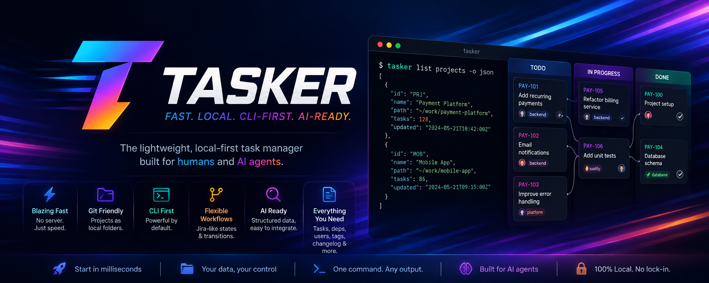

# Tasker

[](https://github.com/applicationx/tasker/actions/workflows/ci.yml)
[](https://github.com/applicationx/tasker/actions/workflows/ci.yml)

Tasker is a small, local-first task manager for coding agents and humans. It is one synchronous Rust executable: no daemon, server, database, account, network request, or prerequisite process. Every project is a self-contained directory whose readable YAML/JSON files work naturally with Git and manual editing.

## Install

### mise (recommended)

```sh
mise install
mise run check
mise run build
mise run install
```

The installed command is `tasker`. To run from the repository without installing, use `mise exec -- cargo run -- ...`.

### Cargo

```sh
cargo install --path . --locked
```

Tasker uses Rust 2024. `Cargo.lock` is committed because this is an application.

## Project root configuration

Tasker discovers project folders directly below `projects_root`. The root is selected in this order:

1. `TASKER_ROOT`
2. the global configuration file in the OS-specific application config directory
3. `~/tasker`

```sh
tasker config show
tasker config get projects-root
tasker config set projects-root ~/Development/tasker-projects
```

`~` is expanded. Other overrides are `TASKER_PROJECT`, `TASKER_ACTOR`, and `TASKER_OUTPUT`. Do not run `config set` merely to develop Tasker; tests use isolated `TASKER_ROOT` directories.

## Quickstart

```sh
export TASKER_ROOT="$HOME/tasker"
export TASKER_ACTOR="jonas"

tasker create project "Example App" --prefix APP
tasker list projects -o json

tasker create task "Implement storage" -p APP --tag backend
tasker create task "Build CLI" -p APP --description "Expose storage operations" --tag cli \
  --acceptance-criterion "JSON output is valid" \
  --acceptance-criterion "CLI integration tests pass"
tasker list tasks -p APP
tasker get task APP-1 -o json
tasker update task APP-1 --header "Implement atomic storage" --description-file notes.md
tasker transition APP-1 in_progress
tasker status APP-1 -o json
```

A project selector (`-p`, `--project`) accepts a prefix, project folder, exact project name, or path. Task-specific commands infer the project from an ID such as `APP-1`; commands also use `TASKER_PROJECT` or the nearest ancestor containing `tasker.yaml`.

Run `tasker --help` for an agent-oriented command map and `tasker <command> --help` for flags and examples.

## Tutorial: autonomous Pi agent workflow

This tutorial is the operating protocol for a Pi agent arriving with no Tasker context. Tasker is designed around a short loop:

```text
discover -> identify -> inspect -> claim -> implement -> report -> verify -> complete
```

The filesystem is authoritative. There is no service to start, account to authenticate, or cache to synchronize.

### 1. Verify Tasker and inspect effective configuration

Start every unfamiliar session with non-mutating discovery:

```sh
tasker --version
tasker config show -o json
tasker list projects -o json
```

If `tasker` is not installed but the agent is inside this repository, bootstrap it with mise:

```sh
mise trust
mise install
mise run check
mise run install
```

If the repository is not available and network installation is explicitly allowed:

```sh
cargo install --git https://github.com/applicationx/tasker.git --locked
```

Ensure Cargo's binary directory (normally `~/.cargo/bin`) is on `PATH`, then rerun `tasker --version`. Do not install or access the network when the user has not authorized it.

Configuration precedence is:

```text
TASKER_ROOT -> global projects-root -> ~/tasker
TASKER_OUTPUT -> global default-output -> human
```

If the user has provided a projects directory and it is not already effective, configure it once:

```sh
tasker config set projects-root ~/Development/projects
tasker config show -o json
```

For temporary or isolated work, prefer an environment override instead of changing global configuration:

```sh
export TASKER_ROOT=/tmp/tasker-projects
```

PowerShell equivalent:

```powershell
$env:TASKER_ROOT = "C:\Development\projects"
tasker config show -o json
```

Do not create or select a project merely because only one seems plausible. Resolve the project in this order:

1. explicit project or task ID supplied by the user;
2. `TASKER_PROJECT`;
3. nearest ancestor containing `tasker.yaml`;
4. `tasker list projects -o json`, then choose only when unambiguous or ask the user.

Inspect the selected project's workflow, relation types, and editable configuration path:

```sh
tasker get project APP -o json --pretty
```

If `tasker.yaml` is manually changed, immediately run:

```sh
tasker validate -p APP -o json
```

### 2. Establish the agent identity

Choose a stable project-local identity and reuse it across sessions. `ensure user` is idempotent:

```sh
tasker ensure user "Pi Backend" -p APP --kind agent -o json
export TASKER_ACTOR=pi-backend
export TASKER_PROJECT=APP
```

PowerShell:

```powershell
tasker ensure user "Pi Backend" -p APP --kind agent -o json
$env:TASKER_ACTOR = "pi-backend"
$env:TASKER_PROJECT = "APP"
```

`TASKER_ACTOR` controls attribution. It is not authentication. Setting `TASKER_PROJECT` is optional when commands contain a task ID or run inside the project directory.

### 3. Find work without racing another agent

Previewing work is useful for inspection:

```sh
tasker next -p APP --as pi-backend -o json
tasker list tasks -p APP --ready -o json
```

The user must already exist for `next --as`, which is why the identity was ensured first. `next` is non-mutating and broader than claim selection.

When ready to take work, avoid a `list -> choose -> claim` race. Claim atomically:

```sh
tasker claim next -p APP --as pi-backend -o json
```

Or claim a known task:

```sh
tasker claim APP-12 --as pi-backend -o json
```

A claim runs under the project lock, checks ownership and dependencies, assigns the task, and transitions it to the configured `claim_state`. If another agent wins, handle the structured conflict and request work again.

### 4. Read the complete task contract before coding

After claiming, inspect all information needed to execute correctly:

```sh
tasker get task APP-12 -o json --pretty
tasker status APP-12 -o json
tasker acceptance list APP-12 -o json
tasker dependency check APP-12 -o json
tasker dependency list APP-12 --recursive -o json
tasker relation list APP-12 --direction both -o json
tasker context list APP-12 -o json
```

Interpret the fields as follows:

- `header`: short identity of the work;
- `description`: what must be implemented;
- `acceptance_criteria`: measurable checks that determine completion;
- `context`: curated background, progress, and decisions from agents;
- `dependencies`: blocking prerequisite tasks;
- `relations`: non-blocking structural links;
- `revision`: optimistic concurrency guard for future mutations.

Do not begin dependency-blocked work unless the user explicitly directs it. Use `status` rather than reproducing workflow rules yourself.

### 5. Report useful progress and decisions

Task context is the durable handoff narrative. Add concise entries while working:

```sh
tasker context add APP-12 \
  "Implemented parser and added malformed-input tests" \
  --kind progress --actor pi-backend

tasker context add APP-12 \
  "Use recursive descent because the grammar is small and fixed" \
  --kind decision --actor pi-backend

tasker context add APP-12 \
  "The upstream format permits comments before the root element" \
  --kind context --actor pi-backend
```

Use the kinds consistently:

- `progress`: concrete work performed and verification completed;
- `decision`: a choice plus enough rationale for the next agent;
- `context`: discovered constraints or background that affects future work.

Do not use context as a raw terminal log. Record outcomes, file areas, tests, risks, and decisions that another agent needs.

### 6. Use revisions for stale-write protection

Read the current task revision:

```sh
tasker get task APP-12 -o json
```

Then guard mutations made from that snapshot:

```sh
tasker update task APP-12 \
  --description-file implementation.md \
  --if-revision 4 \
  --actor pi-backend
```

If Tasker returns `revision_conflict`, reload the task, reconcile concurrent changes, and retry with the new revision. Do not blindly overwrite another agent's work.

### 7. Verify and check acceptance criteria

Acceptance criteria are not a to-do guess; check one only after implementation or test evidence verifies it:

```sh
tasker acceptance list APP-12
tasker acceptance check APP-12 AC-1 --actor pi-backend
tasker acceptance check APP-12 AC-2 --actor pi-backend
tasker status APP-12 -o json
```

If later evidence invalidates a checkpoint, reopen it:

```sh
tasker acceptance uncheck APP-12 AC-2 --actor pi-backend
```

A task with acceptance criteria cannot enter a dependency-satisfying state such as the default `done` until all criteria are checked.

### 8. Complete, block, or hand off the task

When implementation and verification are complete:

```sh
tasker context add APP-12 \
  "Completed implementation; cargo test and clippy pass" \
  --kind progress --actor pi-backend

tasker transition APP-12 done --actor pi-backend -o json
```

If work cannot proceed, report why and use an allowed blocked transition shown by `status`:

```sh
tasker context add APP-12 \
  "Blocked: upstream schema decision is still unresolved" \
  --kind progress --actor pi-backend

tasker transition APP-12 blocked --actor pi-backend -o json
```

For a handoff without changing state, leave a context entry and deliberately choose one assignment operation:

```sh
# Hand directly to a known reviewer
tasker assign APP-12 pi-reviewer --actor pi-backend

# Or release it for another agent to claim
tasker unassign APP-12 --actor pi-backend
```

### 9. Create follow-up work with an explicit contract

Create discovered work rather than hiding it in prose:

```sh
tasker create task "Handle legacy configuration syntax" -p APP \
  --description "Add parsing and migration support for the legacy syntax." \
  --tag parser \
  --acceptance-criterion "Legacy fixtures parse successfully" \
  --acceptance-criterion "Migrated output validates against the current schema" \
  --actor pi-backend -o json
```

Use the returned task ID. Assuming Tasker returned `APP-13`, connect it to existing work:

```sh
tasker dependency add APP-13 APP-12 --actor pi-backend
tasker relation add APP-13 subtask_of APP-3 --actor pi-backend
```

Remember: `APP-13 depends on APP-12` means the first task waits for the second. Generic relations provide structure but do not affect readiness.

### 10. Validate and inspect audit history

Before ending a larger Tasker management session:

```sh
tasker validate -p APP -o json
tasker changelog --task APP-12 --limit 20 -o json
tasker context list APP-12 -o json
```

The changelog is the immutable machine audit trail. Task context is the curated narrative for future humans and agents.

### Copy-paste Pi bootstrap checklist

An unfamiliar Pi agent can use this checklist, replacing `APP` and `pi-agent`:

```sh
tasker --version
tasker config show -o json
tasker list projects -o json
tasker get project APP -o json --pretty
tasker ensure user "pi-agent" -p APP --kind agent -o json
export TASKER_ACTOR=pi-agent
export TASKER_PROJECT=APP
tasker validate -p APP -o json
tasker next -p APP --as pi-agent -o json
tasker claim next -p APP --as pi-agent -o json
# Read the claimed ID from JSON, then:
tasker get task APP-12 -o json --pretty
tasker status APP-12 -o json
tasker acceptance list APP-12 -o json
tasker dependency check APP-12 -o json
tasker context list APP-12 -o json
```

If any command is unclear, use the complete help hierarchy without external documentation:

```sh
tasker --help
tasker claim --help
tasker acceptance --help
tasker context --help
tasker dependency --help
tasker relation --help
tasker search --help
```

## Workflow

Each project has a human-editable `tasker.yaml`. Its workflow defines:

- `initial_state`, used by new tasks;
- `claim_state`, used by claims;
- state labels, terminal status, and whether a state satisfies dependents;
- permitted transitions.

The default states are `backlog`, `ready`, `in_progress`, `blocked`, `done`, and `cancelled`. Tasker never bypasses configured transitions. Edit YAML to customize the workflow, then run `tasker validate -p APP`.

Task content updates are deliberately restricted to `header`, `description`, and `tags`. The description states what should be done. Measurable completion checkpoints are managed through dedicated `acceptance` commands, while append-only agent reports and decisions use `context`. Use dedicated `assign`, `unassign`, `transition`, `dependency`, and `relation` commands for other protected domain fields. Mutating task commands support `--if-revision N` for optimistic concurrency.

## Users, assignment, and actors

Users are project-local attribution records, not security identities.

```sh
tasker create user "Pi Backend" -p APP --kind agent
tasker ensure user "Pi Backend" -p APP --kind agent
tasker list users -p APP
tasker get user "Pi Backend" -p APP
tasker update user pi-backend -p APP --name "Pi Backend Agent"
tasker assign APP-1 "Pi Backend"
tasker unassign APP-1
```

Names are case-insensitively unique. `ensure user` is idempotent. Assignment and claims automatically create unknown users. Mutation actors resolve from `--actor`, `TASKER_ACTOR`, command-specific `--as`, then the OS username.

## Dependencies and readiness

```sh
tasker dependency add APP-2 APP-1       # APP-2 depends on APP-1
tasker dependency list APP-2
tasker dependency list APP-2 --recursive
tasker dependency list APP-1 --reverse
tasker dependency check APP-2 -o json
tasker dependency remove APP-2 APP-1
```

A dependency is satisfied only when its target state has `dependency_satisfied: true` (by default, `done` does and `cancelled` does not). Dependency blocking is derived and does not rewrite workflow state. Self-dependencies and direct or transitive cycles are rejected atomically.

## Acceptance criteria and task context

Acceptance criteria are separate measurable checkpoints with monotonic `AC-N` IDs that are never reused, plus completion attribution:

```sh
tasker acceptance add APP-1 "A seeded run is deterministic"
tasker acceptance list APP-1
tasker acceptance check APP-1 AC-1 --actor pi-backend
tasker acceptance uncheck APP-1 AC-1 --actor pi-backend
tasker acceptance remove APP-1 AC-1
```

If a task has acceptance criteria, all must be checked before transitioning into a dependency-satisfying state such as the default `done`. `tasker status` reports total, completed, and remaining criteria.

Agents append durable, human-readable context without rewriting earlier reports:

```sh
tasker context add APP-1 "Implemented board initialization" --kind progress
tasker context add APP-1 "Use a seeded seven-bag generator" --kind decision
tasker context add APP-1 "The renderer consumes immutable snapshots" --kind context
tasker context list APP-1
tasker context list APP-1 --kind decision
```

Context entry kinds are `context`, `progress`, and `decision`. Entries receive stable `CTX-N` IDs, timestamp, and actor. The global changelog remains the machine audit trail; task context is the curated development narrative agents report back to the task.

## Relations

Generic relations do not affect readiness:

```sh
tasker relation add APP-3 subtask_of APP-2
tasker relation add APP-3 relates_to APP-1
tasker relation list APP-2 --direction incoming
tasker relation remove APP-3 relates_to APP-1
```

`subtask_of` is acyclic and derives the inverse label `parent_of`; `relates_to` is symmetric. Relation types, inverse labels, symmetry, and acyclicity are configured in `tasker.yaml`. Inverses are derived rather than duplicated into a second task file.

## Agent claiming

Claims run under the exclusive project lock and serialize ownership/dependency checks, assignment, transition, revision increment, task write, and the `task.claimed` event with respect to other writers. Resolving an unknown claimant or actor may create its user and `user.created` event before a later eligibility check fails; task state itself is never partly claimed.

```sh
# Query without mutation; --as must already identify a user
tasker ensure user "Pi Backend" -p APP --kind agent -o json
tasker next -p APP --as pi-backend -o json

# Claim a known task or choose the lowest numeric actionable ID
tasker claim APP-1 --as pi-backend -o json
tasker claim next -p APP --as pi-backend -o json
```

Terminal tasks, tasks with unresolved dependencies, tasks owned by another user, and tasks unable to transition to `claim_state` are ignored by `claim next`. `next` is broader and is not an exact dry-run of `claim next`. Competing agents are serialized by `.tasker.lock`; they cannot both claim the same task.

## JSON and YAML

Use `-o human|json|yaml` globally. JSON is compact unless `--pretty` is supplied. Machine-mode stdout contains only result data; errors on stderr are structured in the selected format and process exit codes distinguish input, not-found, conflict, validation, cycle, project, and I/O failures.

Structured creation reads stdin or `--file`:

```sh
printf '%s' '{"header":"Implement search","description":"Scan task files","tags":["CLI"],"acceptance_criteria":["Header matches are found","Description matches are found"]}' \
  | tasker create task -i json -p APP -o json

tasker create task -i yaml --file new-task.yaml -p APP -o yaml
printf '%s' '{"header":"New header","tags":["backend"]}' \
  | tasker update task APP-1 -i json -o json
```

Update input is a patch. Protected or unknown fields are rejected rather than ignored. Tasker-managed files are pretty printed with trailing newlines and deterministic tag, dependency, and relation ordering.

## Search and status

Task search scans `tasks/*.json` directly, so manual edits and Git checkouts are visible immediately:

```sh
tasker search tasks authentication -p APP
tasker search tasks websocket -p APP --state backlog --state ready
tasker search tasks -p APP --tag backend --assignee pi-backend -o json
tasker search tasks -p APP --ready --limit 20 --full
tasker search tasks -p APP --dependency-blocked
```

Text matching is case-insensitive substring matching across task content, acceptance criteria, and context; whitespace-separated terms use AND semantics. Repeated states use OR, repeated tags use AND. Compact results are limited to 50 by default. `tasker status APP-1` returns unresolved dependencies, acceptance completion, allowed transitions, and claimability.

## Project knowledge and agent briefs

Tasker keeps six related concepts distinct:

1. **`PROJECT.md`** records project purpose, goals, constraints, architecture, and direction.
2. **Resources** catalog supporting Markdown, either managed by Tasker or referenced live from a safe project-relative path.
3. **Decisions** record proposed and settled product/architecture choices with rationale and consequences.
4. **Task `context_refs`** explicitly link execution work to relevant resources and decisions.
5. **Task context** is the append-only curated execution narrative: background, progress, and task-level choices.
6. **The changelog** is the immutable machine audit trail of mutations.

`tasker brief` assembles those authoritative sources for an agent; it is a generated view, not a seventh stored source.

### Copy-paste planning-to-execution workflow

```sh
# Establish project direction and reusable planning knowledge.
tasker project brief show -p APP -o markdown
tasker create resource "Requirements" -p APP --kind requirement --status active --file requirements.md
tasker create resource "Architecture" -p APP --kind design --path docs/architecture.md
tasker create decision "Keep files authoritative" -p APP -o json
tasker decision accept APP-D1

# Turn the plan into linked execution work and inspect the assembled contract.
tasker create task "Implement requirements" -p APP \
  --description "Implement the accepted filesystem-backed plan." \
  --from APP-R1 --context-ref APP-D1:constrained_by \
  --acceptance-criterion "Focused tests pass" -o json
tasker brief APP-1 -o markdown
tasker claim APP-1 --as pi-agent -o json

# Report, verify, complete, and audit.
tasker context add APP-1 "Implemented the planned vertical slice" --kind progress --actor pi-agent
tasker acceptance check APP-1 AC-1 --actor pi-agent
tasker transition APP-1 done --actor pi-agent -o json
tasker changelog --task APP-1 -o json
tasker validate -p APP -o json
```

Every new project has a root `PROJECT.md` with Purpose, Goals, Non-goals, Constraints, Architecture, Current direction, and Open questions sections. It has no frontmatter, so humans and agents can edit it directly. Legacy projects initialize it explicitly:

```sh
tasker project brief show -p APP -o markdown
tasker project brief path -p APP -o json
tasker project brief init -p APP
tasker project brief set -p APP --file updated-project.md
```

Resources receive monotonic project-prefixed IDs (`APP-R1`) and use exactly these kinds: `brief`, `requirement`, `design`, `research`, `plan`, and `reference`. Status is `draft`, `active`, or `archived`. A managed record owns its body; a referenced record has `source_path` and reopens that current project file for every get, search, validation, and brief:

```sh
tasker create resource "CLI design" -p APP --kind design --status active --file cli-design.md
tasker create resource "Existing architecture" -p APP --kind design --path docs/architecture.md
tasker list resources -p APP
tasker get resource APP-R2 -o json
tasker update resource APP-R1 --tag cli --include-in-project-brief --if-revision 1
tasker archive resource APP-R1
tasker search resources "atomic output" -p APP --full -o json
```

A resource file has typed frontmatter followed by a catalog body. `source_path` is absent for managed resources and present for referenced resources:

```markdown
---
id: APP-R1
title: CLI design
kind: design
status: active
tags:
- cli
include_in_project_brief: true
created_at: 2026-08-09T18:30:00.000Z
updated_at: 2026-08-09T18:30:00.000Z
created_by: pi-agent
updated_by: pi-agent
revision: 1
---
# CLI design

Commands emit deterministic output.
```

Referenced paths are stored with `/` separators. Absolute, rooted, drive/UNC, NUL, parent-component, missing, non-file, escaping-symlink, non-UTF-8, and over-1-MiB sources are rejected. Tasker reads through a capability rooted at the project and never changes the referenced source.

Decisions receive IDs such as `APP-D1`, default to `proposed` and project scope, and require these ATX headings in order: Context, Options considered, Decision, Rationale, and Consequences. Scope is `project` or `linked`; status is `proposed`, `accepted`, `rejected`, or `superseded`:

```sh
tasker create decision "Keep filesystem authority" -p APP
# Or supply a completed five-section body:
tasker create decision "Keep filesystem authority" -p APP --scope project --file decision.md
tasker decision accept APP-D1
tasker decision reject APP-D2
tasker decision supersede APP-D1 --with APP-D3 --if-revision 2 --with-if-revision 2
tasker search decisions filesystem -p APP --full -o json
```

Decision metadata records `id`, `title`, `status`, `scope`, canonical `tags`, creation/update attribution, nullable `decided_at`/`decided_by`, `supersedes`, nullable `superseded_by`, and `revision`. Its body follows this contract:

```markdown
# Context

Why a choice is needed.

# Options considered

## Option one

Trade-offs.

# Decision

The chosen direction.

# Rationale

Why it is preferred.

# Consequences

Resulting constraints and work.
```

Only proposed decisions permit title, body, or scope changes. Settled decisions permit tags only. Supersession requires two accepted decisions and updates the predecessor status/backlink and replacement `supersedes` list as one recoverable batch under `.tasker.lock`. Before/after images are transient under `.tasker-transactions`; the immutable event containing `transaction_id` is the commit marker. A later mutation rolls an uncommitted batch back or completes a committed batch, and refuses to overwrite unexpected manual edits. `validate` only reports pending artifacts; it never recovers them.

Tasks store authoritative links in `context_refs`, separate from append-only task narrative context. Kinds are `resource` and `decision`; roles are `implements`, `informed_by`, `constrained_by`, and `verifies`:

```sh
tasker create task "Implement search" -p APP \
  --context-ref APP-R1:implements --from APP-D1
tasker context-ref add APP-1 APP-D1 --role constrained_by
tasker context-ref list APP-1 -o json
tasker context-ref reverse APP-D1 -o json
```

Generate a deterministic current snapshot without an index:

```sh
tasker brief -p APP -o markdown
tasker brief APP-1 --max-bytes 50000 -o json --pretty
```

Project briefs and task briefs have one stable structured shape. Inclusion priority is project/task identity; task description and acceptance criteria; linked accepted decisions; linked active resources; dependency state and relations; task context; accepted project decisions; `PROJECT.md`; linked historical decisions; requested archived resources; then proposed decisions and summaries. Archived resource metadata is excluded unless `--include-archived` is explicit. The byte cap applies to the exact final JSON, YAML, human, or Markdown bytes including its newline. Complete lower-priority bodies are omitted before metadata, linked accepted-decision and non-archived-resource metadata is retained, every omission is recorded under `truncation.omitted`, human/Markdown output displays a truncation notice, and an impossibly small limit returns `brief_limit_too_small` rather than malformed output.

Knowledge mutations support JSON/YAML structured input with `-i` and `--input-file`; `--file` always means Markdown body on these commands, and direct flags override structured fields. Markdown frontmatter rejects unknown fields. Metadata-only updates preserve body bytes, filenames do not change when titles do, no-op updates preserve revision and emit no event, and archived IDs are never reused.

## Changelog

Every successful state-changing mutation adds one immutable file to the project-wide changelog. No-op operations add no task event. Resolving a new actor may add `user.created` even if the requested domain operation later fails:

```sh
tasker changelog -p APP --limit 20
tasker changelog --task APP-1
tasker changelog -p APP --actor pi-backend --action task.transitioned
tasker search changelog "APP-1 done" -p APP
```

Events snapshot actor ID/name and meaningful changed values. Knowledge actions are exactly `project.brief.created`, `project.brief.updated`, `resource.created`, `resource.updated`, `resource.archived`, `decision.created`, `decision.updated`, `decision.accepted`, `decision.rejected`, `decision.superseded`, `task.context_ref.added`, and `task.context_ref.removed`. Their changes contain IDs, paths, revisions, SHA-256 hashes, byte counts, and transaction IDs—not complete Markdown bodies or referenced source content. Current files, not events, remain authoritative.

## Storage and Git

```text
example-app/
├── tasker.yaml                    # human-editable workflow and relations
├── meta.json                      # next task/resource/decision numbers
├── PROJECT.md                     # project purpose and direction
├── .tasker.lock                   # stable lock target
├── resources/APP-R1-cli-design.md # managed/referenced resource frontmatter + catalog body
├── decisions/APP-D1-storage.md    # decision frontmatter + required sections
├── tasks/APP-1.json               # one authoritative task, including context_refs
├── users/pi-backend.json          # one file per local identity
└── changelog/<time>_<uuid>.json
```

Mutable managed files use same-directory atomic replacement. Changelog files are immutable and independently created. Normal updates therefore produce focused Git diffs: one task file changes and one event file is added. There is no hidden database or search index. Project directories can be copied, cloned, branched, merged, inspected, and manually edited.

Do not commit the lock's transient state as meaningful content; the stable empty `.tasker.lock` path itself is harmless. Task IDs are never reused, though a crash may leave a numeric gap.

## Validation

```sh
tasker validate -p APP -o json
```

Validation always returns `{ "valid", "errors", "warnings" }`. It checks typed schemas; task/user/resource/decision filenames and IDs; workflow and graph invariants; acceptance, narrative context, and `context_refs`; canonical frontmatter tags/timestamps/revisions; safe live sources; decision sections, lifecycle attribution, and bidirectional acyclic supersession; all three allocators; transaction artifacts; and changelog schema versions. Errors exit 5. A legacy project missing `PROJECT.md`, `resources/`, or `decisions/` remains valid and receives `project_knowledge_not_initialized` with an initialization suggestion; warnings exit 0 and validation performs no repair or initialization.

Knowledge frontmatter is YAML bounded by exact `---` lines and rejects unknown fields. IDs must match each filename's leading ID (`APP-R1[-slug].md` or `APP-D1[-slug].md`). Existing schema-v1 `meta.json` files default new counters to 1, and existing task files default `context_refs` to an empty array. Once a new counter or task link is persisted, older Tasker binaries with strict unknown-field handling may reject that file; this is the documented downgrade boundary.

## Complete agent flow

```sh
tasker list projects -o json
tasker ensure user "Pi Backend" -p APP --kind agent -o json
tasker next -p APP --as pi-backend -o json
tasker claim next -p APP --as pi-backend -o json
tasker get task APP-7 -o json
tasker dependency check APP-7 -o json
tasker acceptance list APP-7 -o json
tasker context add APP-7 "Implemented the first vertical slice" --kind progress --actor pi-backend
tasker context add APP-7 "Selected atomic file replacement" --kind decision --actor pi-backend
tasker acceptance check APP-7 AC-1 --actor pi-backend
tasker create task "Follow-up validation" -p APP --tag testing -o json
tasker dependency add APP-8 APP-7
tasker relation add APP-8 subtask_of APP-3
tasker transition APP-7 done --actor pi-backend -o json
tasker changelog --task APP-7 -o json
tasker validate -p APP -o json
```

## Development

```sh
mise run fmt
mise run clippy
mise run test
mise run check
mise run build
```

Coverage uses `cargo-llvm-cov` and is required to remain at or above 85% line coverage:

```sh
mise exec -- cargo install cargo-llvm-cov --locked
mise run coverage
```

CI runs the same threshold check and updates the coverage badge after successful pushes to `main`.

See [AGENTS.md](AGENTS.md) for repository rules.
